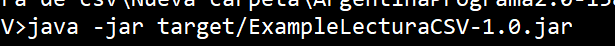

# Ejemplo de lectura de archivo CSV y generación de un objeto

*Fue desarrollado durante el dictado de un curso de JAVA en colaboración que los alumnos que solicitaron saber cómo estaba estructurado el CSV y como deberían comenzar con el Parseo.*

En el Main de este proyecto van a ver una forma de "parsear" la ruta de un archivo .CSV que se ingrese por argumento en la ejecucción del programa

Pero, ¿Que es Parsear?
> Proceso de analizar una secuencia de símbolos a fin de determinar su estructura gramatical definida. También llamado análisis de sintaxis.
Un parseador (parser) es un programa de computación que lleva a cabo esta tarea. El parseo transforma una entrada de texto en una estructura de datos (usualmente un árbol) que es apropiada para ser procesada.
Generalmente los parseadores primero identifican los símbolos de la entrada y luego construyen el árbol de parseo.

En nuestro caso vamos a usarlo para referirnos a la acción de obtener los distintos campos que llegan en el archivo CSV separados por punto y coma. 

## Contexto sobre el que se planteo el ejemplo
_En el modelo elegido para este ejemplo tenemos un archivo que ingresa con información de Resultados y Pronósticos

**Consideraciones**
Es necesario tener instalado Maven, porque vamos a utilizar al gestor de dependencias para incluir una clase a nuestro proyecto

Van a poder ver dentro del archivo pom.xml estas líneas que justamente lo que hacen es agregar la dependencia de dicha clase
```
    <dependencies>
        <dependency>
            <groupId>com.opencsv</groupId>
            <artifactId>opencsv</artifactId>
            <version>5.5.2</version>
        </dependency>
    </dependencies>
```

También van a encontrar otra sección dentro del mismo archivo con lo siguiente

```
    <build>
        <plugins>
            <plugin>
                <groupId>org.apache.maven.plugins</groupId>
                <artifactId>maven-shade-plugin</artifactId>
                <version>3.2.4</version>
                <executions>
                    <execution>
                        <phase>package</phase>
                        <goals>
                            <goal>shade</goal>
                        </goals>
                        <configuration>
                            <transformers>
                                <transformer implementation="org.apache.maven.plugins.shade.resource.ManifestResourceTransformer">
                                    <mainClass>org.example.Main</mainClass>
                                </transformer>
                            </transformers>
                        </configuration>
                    </execution>
                </executions>
            </plugin>
        </plugins>
    </build>
```

Todo esto se utiliza para que ejecutemos la instrucción de Maven 
```mvn package```
se genere un archivo ejecutable dentro de la carpeta /target y que ustedes puedan ejecutar por consola el proyecto




Tengan presente que el tag **"\<mainClass\>"** debe tener la ruta de su clase Main
```<mainClass>org.example.Main</mainClass>```


Por último, van a ver que en el Resultado.java, donde tenemos definidos los objetos que queremos obtener a partir del archivo hay algunas anotaciones

Esas anotaciones **@CsvBindByPosition(position=0)** lo que están haciendo es indicarle a nuestro Parseador que atributo vamos a tener en cada posición del archivo
